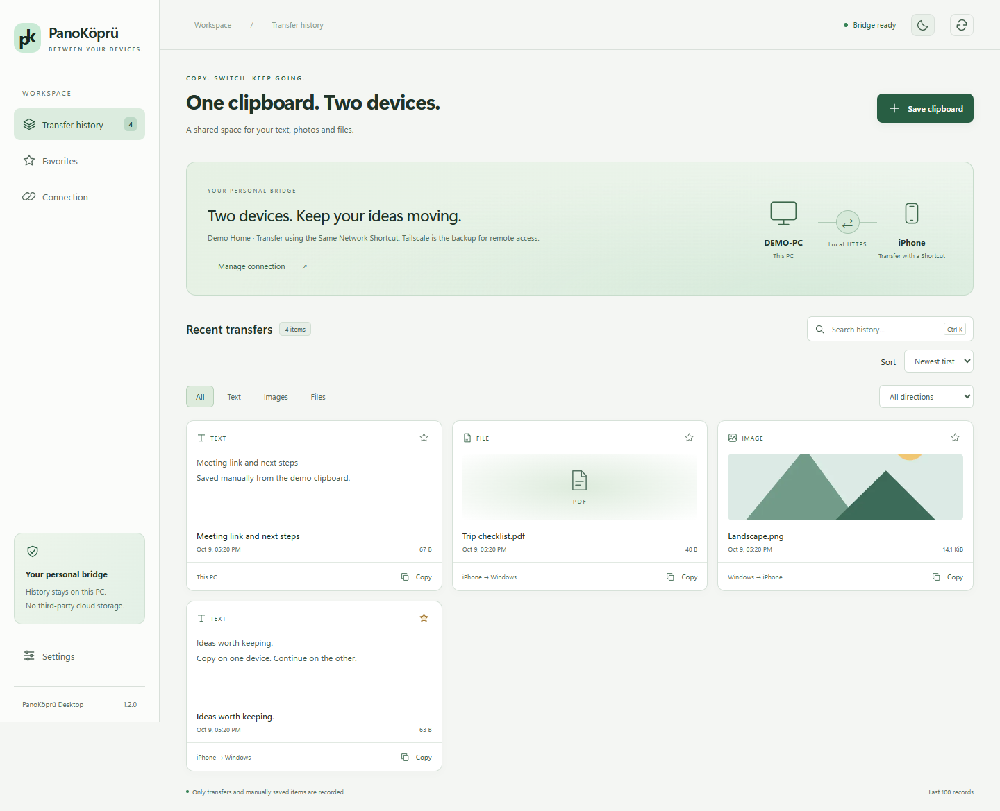
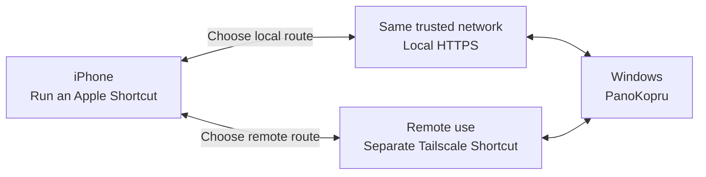

# PanoKopru
### Your text, photos and files — between Windows and iPhone.

[English](README.md) · [Türkçe](README.tr.md) · [Setup guide](docs/QUICKSTART.md) · [Apple Shortcuts](docs/SHORTCUTS.md)

PanoKopru is a Windows–iPhone clipboard bridge. Run an Apple Shortcut to send or
receive an item, then keep working on your other device. Use **local HTTPS on a
trusted network**, without Tailscale, or separate **Tailscale Shortcuts** remotely.

> **Source release · version 1.2.0**
>
> No downloadable EXE or installer is published yet. The source-built installer
> has **not been tested on clean Windows or with a real iPhone transfer**.
> Rebuilding libvips from the source companion and verifying compatibility also
> remain pending. Automated tests do not replace these checks.

## A look at the desktop

<picture>
  <source media="(prefers-color-scheme: dark)" srcset="docs/images/history-dark.png">
  
</picture>

*Screenshots show the real English app interface with synthetic demo data.
They do not constitute a clean Windows/iPhone acceptance test.*
[How the screenshots are made](docs/SCREENSHOTS.md)

## What you can do

| Feature | How it works |
| --- | --- |
| **Text, photos and files** | Transfer in both directions using Apple Shortcuts |
| **Local HTTPS** | Connect on approved home, Ethernet or personal hotspot networks; no Tailscale required |
| **Remote access** | Use separate, optional Tailscale send/receive Shortcuts |
| **Desktop history** | Revisit transfers, add favorites and search filenames or text previews |
| **English and Turkish** | Choose Settings → Language; your preference is saved across restarts |
| **Light and dark themes** | Choose the desktop appearance |
| **Trusted networks** | Add/remove networks, repair permissions and clean up owned Windows firewall rules |
| **Storage controls** | Choose a retention threshold and explicitly clean up managed incoming files |

There is **no automatic iPhone clipboard synchronization or automatic
local/Tailscale switching**. You choose and run the Shortcut. Back Tap is an
optional iPhone setting for triggering it.

## How the connection works



| Direction | Everyday action | Result |
| --- | --- | --- |
| **iPhone → Windows** | Copy an item → run the send Shortcut → Ctrl+V on Windows | Text pastes; photos/files can be pasted into Explorer or the desktop |
| **Windows → iPhone** | Ctrl+C → run the receive Shortcut | Text goes to the clipboard; images can be saved to Photos; files go to your chosen location |

The receive Shortcut fetches content and its type separately. Keep the Windows
clipboard unchanged between those requests. A desktop **ready** indicator means
the Windows listener is ready; it does not verify phone connectivity.

## Setup, in four steps

These steps describe the **private acceptance package**. They are provided for
review and future testing; there is currently no public installer download.

1. **Install on a clean Windows x64 computer.** Extract the whole package and
   keep `PanoKopruSetup.exe` beside `payload`. Run setup as a normal user.
2. **Choose a network you control.** Approve the narrow Windows permission
   request. Setting the network to **Private** can also affect other apps'
   existing Private-profile rules.
3. **Verify and trust your certificate.** Compare the certificate fingerprint
   on Windows and iPhone before enabling trust. Finish the local HTTPS pairing.
4. **Create two Apple Shortcuts.** Use your own endpoint and access key for send
   and receive. Test both directions with sample text, a photo and a PDF.

**[Read the full English setup guide →](docs/QUICKSTART.md)**

[Kurulum rehberi — Türkçe](docs/QUICKSTART.tr.md)


The initial, short-lived HTTP link downloads **only the public CA certificate**.
Clipboard data and pairing credentials use HTTPS. Full trust in an iPhone root
certificate is broader than permission for this one application; compare the
fingerprint independently and never bypass a certificate warning.

## You control network access


**Remove a network** revokes PanoKopru's trust in that network. It does not revert
the Windows network profile or delete firewall rules. **Clean up permissions** is
a separate, administrator-approved operation that removes owned PanoKopru rules;
it leaves Windows profiles and Tailscale settings unchanged.

Trust only networks you control. A network name alone is not authentication:
the application also checks its saved network/adapter, certificate and access key.

## Requirements and limits

The first installer targets **Windows x64**: Windows 11 or Windows 10 build
19045+, with a standard, non-redirected user profile. ARM64 and 32-bit builds are
not supported. Keep the operating system supported and updated.

- **iPhone:** Apple Shortcuts; local use requires the same trusted network.
- **WebView2:** Evergreen Runtime is required. Setup can open Microsoft's
  official download page; it does not automatically install the Runtime.
- **Node.js:** bundled in the private package; developers install Node separately.
- **Tailscale:** optional for remote use.
- **Inbound files/video:** 512 MiB. **Inbound text/image processing:** 64 MiB.
- The outbound path has no equivalent overall limit. The 256 MiB history cache
  budget is not a total application disk quota.

The first version supports **clean installs only** and refuses existing program
or data folders. Automatic updates, production rollback and legacy data migration
are deferred. Removal preserves user data; retained data prevents another clean
install under the same account. See the setup guide for the removal procedure.

## Development

Read [AGENTS.md](AGENTS.md), [PROJECT-STATUS.md](PROJECT-STATUS.md) and
[the roadmap](docs/ROADMAP.md) first. The current test baseline uses Windows and
Node.js 24.15.0. In PowerShell:

```powershell
npm.cmd ci --ignore-scripts --no-audit --no-fund
npm.cmd test
npm.cmd run test:ui
npm.cmd run check:source
npm.cmd run check:history
```

The UI test uses Microsoft Edge, temporary data and synthetic OS adapters.
The `SOURCE-CHECKOUT` guard deliberately blocks production startup and real OS
actions from a source checkout; **do not delete it to run the app**.
`build:native` compiles only, `build:candidate` produces a guarded engineering
payload, and `build:test-package` explicitly creates a private acceptance package.

To regenerate the English screenshots:
`node scripts/capture-docs.js`. Review the images before updating their pinned
hashes. The script selects the real English language option in an isolated fixture.

## Documentation

| Topic | Guide |
| --- | --- |
| Installation, pairing and removal | [English setup guide](docs/QUICKSTART.md) · [Türkçe](docs/QUICKSTART.tr.md) |
| Language selection | [English / Turkish support](docs/LOCALIZATION.md) |
| Apple Shortcut actions | [Send and receive guide · EN/TR](docs/SHORTCUTS.md) |
| Architecture and data boundaries | [Architecture](docs/ARCHITECTURE.md) |
| Network and certificate security | [Local-network model](LOCAL-NETWORK.md) |
| Troubleshooting | [Troubleshooting](docs/TROUBLESHOOTING.md) |
| Test and release status | [Project status](PROJECT-STATUS.md) · [Acceptance matrix](docs/ACCEPTANCE.md) |
| Native sources and rebuild | [Native rebuild](docs/NATIVE-REBUILD.md) |
| Third-party distribution review | [Third-party notices](THIRD-PARTY-NOTICES.md) |
| Changes | [Changelog](CHANGELOG.md) |

## License

PanoKopru is licensed under **GPL-3.0-or-later**. See [LICENSE](LICENSE).
Third-party components retain their own licenses; their binary distribution
review is still pending. The source repository contains no personal clipboard
history, access keys, certificates or installed user profiles.
