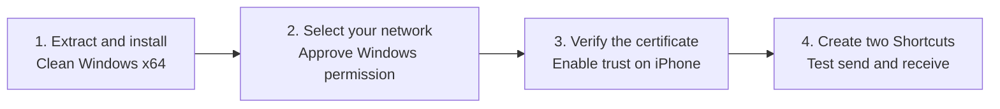
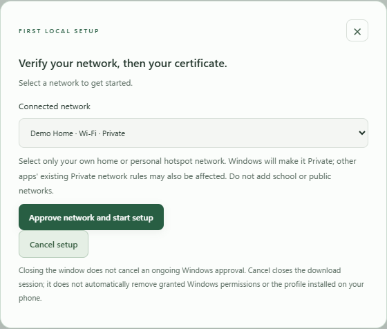
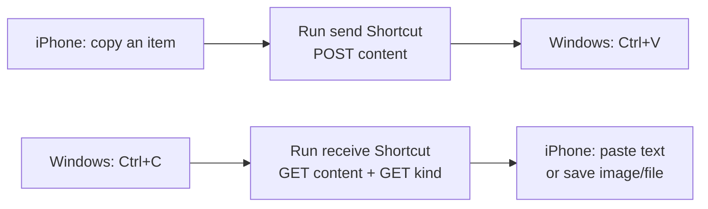
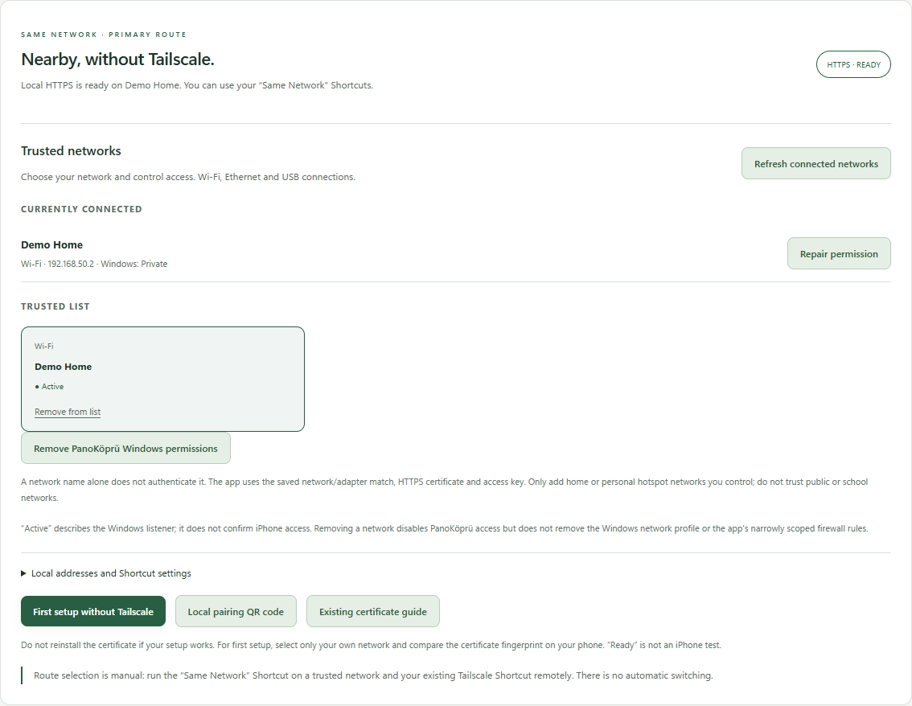

# Setup and iPhone pairing
**Source/package target 1.2.1 · experimental acceptance, not stable**

[Back to README](../README.md) · [Türkçe kurulum rehberi](QUICKSTART.tr.md)

> **Testing is pending.** No public installer download is available yet.
> The source-built setup has not been tested on clean Windows or with a real
> iPhone transfer. The libvips source rebuild and Windows DLL checks have passed;
> this guide describes the intended device acceptance flow, not completed
> installation/phone-test evidence.

Version **1.2.1** supports **English / Türkçe**. Choose **Settings → Language →
English** (or **Ayarlar → Dil → English**). The choice survives reopening.
The screenshots show the real English interface with synthetic data.
The historical private **1.1.0** package predates this language update. The current
1.2.1 candidate is prepared for experimental release review; public binary
publication remains a separate step. English button names below
include Turkish equivalents where useful.

## The setup path



## 1. Prepare and install

Use a separate computer with **no existing ClipBridge or PanoKopru program/data**.

| Requirement | First-package scope |
| --- | --- |
| Windows | Windows 11 or Windows 10 build 19045+; keep it supported and updated |
| Architecture | Intel/AMD x64; ARM64 and 32-bit are unsupported |
| Account | Normal Windows user, standard non-redirected profile |
| iPhone | Apple Shortcuts and access to your trusted home network |
| WebView2 | Evergreen Runtime; use setup's official Microsoft link if missing |
| Node / Tailscale | Node is bundled; Tailscale is optional for remote use |

1. Verify the package's SHA-256 against its delivery record. Setup is unsigned.
   Do not disable security protections to get past an unexpected warning.
2. Extract the **whole ZIP** into a local folder. Do not launch setup from inside
   the ZIP. Keep this layout intact:

   ```text
   ClipBridge-1.2.1-win-x64-test/
   |-- ClipBridgeSetup.exe
   |-- payload/
       |-- release.json
       |-- app/
       |-- source/
   ```

3. Open `ClipBridgeSetup.exe` as a **normal user**, not with “Run as administrator.”
   If WebView2 is missing, use setup's Microsoft download-page button to install
   the x64 Evergreen Runtime, then reopen setup.
4. Read the explanation and approve the installation. Startup at login is
   optional and **off by default**. Existing program **or data** causes setup to
   stop; this installer does not overwrite, update or migrate them.
5. Open ClipBridge from the Windows Start menu.

Program files and personal data are separate:
`%LOCALAPPDATA%/Programs/ClipBridge` and `%LOCALAPPDATA%/ClipBridge`.
Keep the extracted setup for removal later.

These are the new 1.2.1 build names, not a public download. The previously
recorded private 1.1.0 artifact still uses `PanoKopruSetup.exe` and old paths;
it has not been renamed or rebuilt. See [compatibility](BRANDING.md).

## 2. Choose your trusted network

Connect Windows and iPhone to the **same home network or personal hotspot you
control**. Guest-network client isolation, blocked mDNS or managed-network
policies can prevent a connection.



1. Open **First setup without Tailscale** (`Tailscale’siz ilk kurulum`).
2. Select the connected network.
3. Choose **Approve network and start setup** (`Ağı onayla ve kurulumu başlat`).
4. Approve the Windows UAC prompt.

This changes the selected Windows network to **Private**. Other apps' existing
Private-profile firewall rules may also become applicable. Do not trust a
public, school or university network just to make the test pass.

If you cancel, retry the wizard or use the separate permission-cleanup action.
Closing the dialog does not cancel a Windows approval already in progress.

## 3. Verify the certificate on iPhone

1. Open the wizard's **temporary certificate QR link** on iPhone.
   This HTTP link carries only the **public CA certificate**, not clipboard
   contents, pairing keys or private keys.
2. Compare the certificate's **SHA-256 fingerprint** shown on the phone with
   the value displayed on Windows. If they differ, stop.
3. Install the downloaded profile under **Settings → General → VPN & Device
   Management**.
4. Under **Settings → General → About → Certificate Trust Settings**, explicitly
   enable full trust for this installation's ClipBridge root certificate.
5. Confirm the fingerprint and trust step in the Windows wizard. Continue to
   the local **HTTPS pairing** screen.

iOS labels can vary by version and language; this flow still needs real-device
verification. Root trust is not limited to this app or network: it trusts
certificates signed by that CA. Never bypass TLS errors.

Use **your own endpoint and access key** from pairing. Never post screenshots
of the pairing QR or Authorization header. If the temporary session expires,
restart it through the wizard.

## 4. Create send and receive Shortcuts

Follow the [Apple Shortcuts guide](SHORTCUTS.md). A signed/importable Shortcut
package is not included; create the actions manually.



| Shortcut | Requests | What to do with the result |
| --- | --- | --- |
| **iPhone → Windows** | POST to your clipboard endpoint, Form **File** field `content` | Ctrl+V on Windows; use Explorer/Desktop for photos and files |
| **Windows → iPhone** | GET content, then GET `/kind`; your Authorization header on both | `text`: copy to clipboard; `image`: save to Photos; `file`: ask where to save |

Do not change the Windows clipboard between the two receive requests; they are
not an atomic snapshot. Do not save a type label or an error JSON as a file.

Local Shortcuts do not start Tailscale. Remote Tailscale Shortcuts are separate
and optional. **You select the route manually.** Back Tap is an optional shortcut
trigger, not automatic clipboard synchronization.

## Managing network access



| Action | Effect |
| --- | --- |
| **Add / repair permission** | Requests administrator approval and validates the selected connected network |
| **Remove** (`Listeden çıkar`) | Revokes app trust; does not revert the Windows profile or delete firewall rules |
| **Clean up permissions** (`ClipBridge Windows izinlerini temizle`) | Removes only owned ClipBridge firewall rules with UAC approval; leaves the network profile and Tailscale settings unchanged |

“Ready” means the Windows listener is ready. It does not prove iPhone reachability.

## Basic acceptance checklist

Use synthetic content. Report the Windows version/architecture, package version
and hash, passing/failing step and sanitized error code.

- [ ] Clean installation and first launch.
- [ ] Cancel the initial UAC prompt, then retry.
- [ ] Clean up permissions during partial onboarding, then restart setup.
- [ ] Complete local certificate trust and pairing with Tailscale off.
- [ ] Transfer Unicode text in both directions.
- [ ] Transfer a small JPEG/PNG and a synthetic PDF in both directions.
- [ ] Paste an incoming file on the Windows desktop; save an incoming iPhone
      photo to Photos and a PDF to a chosen Files location.
- [ ] Fully stop the app through its tray menu, reopen it and transfer again.
- [ ] Remove the program using the procedure below; verify data preservation.

Also request full exit during a pending UAC prompt or transfer. Pending work
must finish safely and must not reopen a service after shutdown. You may need
to respond to the pending Windows prompt. Report a hang rather than killing
unknown processes or deleting installation folders.

Do not mark device acceptance passed until this checklist has actually been run.

## Data-preserving removal

Reopen the **same version's extracted** `ClipBridgeSetup.exe` and choose
**Remove (keep data)** (`Kaldır (veriler korunur)`).

Setup stops the app and removes verified owned program files, shortcuts, startup
shortcuts and firewall rules. Firewall cleanup requires UAC; cancelling it
retains the program. Windows network profiles and Tailscale settings stay as-is.
User data and the Windows CA identity are preserved.

On iPhone, manually remove only this installation's ClipBridge certificate profile
under **General → VPN & Device Management**.

Retained data prevents another clean install under the same account. Use a
separate clean account or VM for repeat acceptance. Keep setup: this test package
has no separate uninstall entry in Windows Settings. Do not randomly delete a
maintenance lock after interrupted removal.

## Known limits

- No automatic clipboard synchronization, local/Tailscale switching or fallback.
- No automatic update, production rollback or legacy migration in this version.
- Inbound files/video: **512 MiB**. Inbound text/image processing: **64 MiB**.
  The outbound path has no identical overall limit.
- The history cache budget is not a total disk quota.
- English and Turkish are available in the 1.2.1 source; the older 1.1.0 acceptance package has not been rebuilt.
